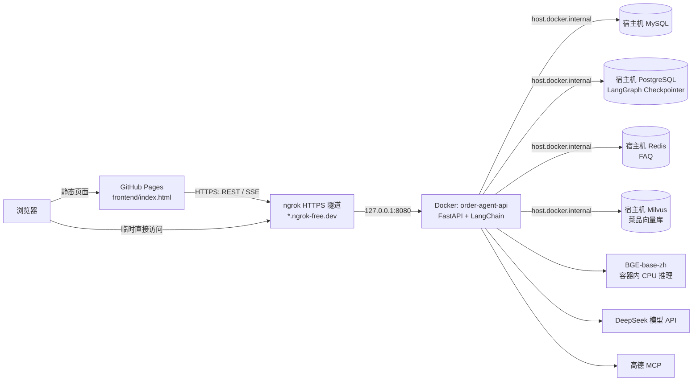

# 本地 Docker + ngrok 部署

## 访问地址

| 用途 | 地址 | 当前状态 |
| --- | --- | --- |
| 当前前端（ngrok） | `https://uprising-ladybug-curly.ngrok-free.dev/` | 已验证 HTTP 200 |
| 当前后端健康检查 | `https://uprising-ladybug-curly.ngrok-free.dev/healthz` | 已验证 HTTP 200 |
| 本地前端/后端 | `http://127.0.0.1:8080/` | 由 Docker 容器提供 |
| GitHub Pages 前端 | `https://liukelly1993-ship-it.github.io/order-agent/` | 推送并完成 Actions 发布后可用 |

ngrok 免费域名直接用浏览器打开时可能出现一次提示页；GitHub Pages 前端请求 API 时会自动携带跳过提示页的请求头。

## 技术架构



### 请求链路

| 功能 | 请求路径 | 后端依赖 |
| --- | --- | --- |
| 智能聊天 | `POST /chat`（SSE） | LangGraph、PostgreSQL、DeepSeek；按问题调用 MySQL、Milvus/BGE 或高德 MCP 工具 |
| FAQ | `GET /faq/suggest` | Redis |
| 配送查询 | `POST /delivery` | 当前配送规则与高德 MCP 初始化 |
| 前端健康检查 | `GET /openapi.json` | FastAPI |

容器仅暴露 `127.0.0.1:8080`，MySQL、PostgreSQL、Redis 和 Milvus 不通过 ngrok 暴露公网。容器通过 `host.docker.internal` 访问宿主机服务。

### 资源实测

- 镜像大小：约 802 MB。
- API 空载内存：约 227 MiB。
- BGE/Milvus 菜品检索后：约 541～554 MiB。
- Compose 为 API 容器设置的上限：2 GiB。

## 当前结构

- 前端：GitHub Pages 发布 `frontend/`
- 公网 API：`https://uprising-ladybug-curly.ngrok-free.dev`
- 本地 API：Docker 容器 `order-agent-api`，仅绑定 `127.0.0.1:8080`
- 数据服务：复用宿主机 MySQL、PostgreSQL、Redis 和 Milvus

## 启动

确保宿主机四个数据服务已启动，然后执行：

```bash
docker compose up -d --build
ngrok http 8080
```

检查状态：

```bash
docker compose ps
curl http://127.0.0.1:8080/healthz
curl https://uprising-ladybug-curly.ngrok-free.dev/healthz
```

查看日志和内存：

```bash
docker compose logs -f order-agent-api
docker stats --no-stream order-agent-api
```

## 停止

前台运行 ngrok 时按 `Ctrl+C` 停止隧道。停止 API 容器：

```bash
docker compose stop order-agent-api
```

## GitHub Pages

`.github/workflows/pages.yml` 会在 `master` 分支的 `frontend/` 或工作流自身发生变化后，把 `frontend/` 发布到 `https://liukelly1993-ship-it.github.io/order-agent/`。

注意：

- **GitHub Actions 评估 workflow 文件用的是 default branch（当前是 `main`）上的版本**，所以 `master` 上对 `pages.yml` 的修改必须同步到 `main`，否则修改不会生效。
- `configure-pages` 步骤加了 `enablement: true`，首次运行会自动创建 Pages site，不需要手动去 `Settings → Pages` 选择 Source。
- 代码 push 由仓库所有者执行。

## 注意事项

- 电脑、Docker、宿主数据库和 ngrok 必须保持运行，公网功能才可用。
- `.env` 不会打进镜像，也不能提交到 Git。
- Docker 中使用 CPU 加载 BGE；不要把 `EMBEDDING_DEVICE` 改为 `mps`。
- 只对外开放 FastAPI，不要为数据库端口创建 ngrok 隧道。
- 分享公网地址前，应轮换源码历史中出现过的高德 MCP Key，并迁移到环境变量。
